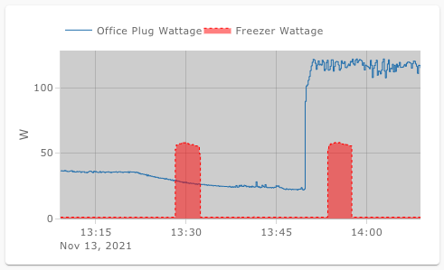
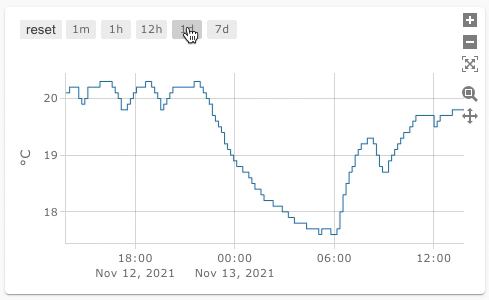
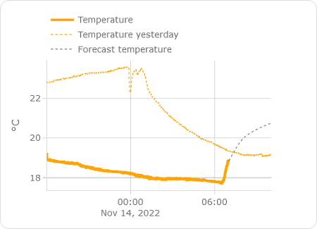
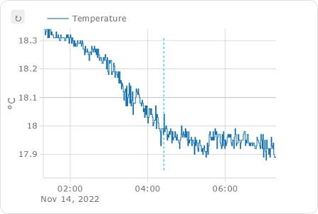

[](https://www.buymeacoffee.com/dbuezas)
[](https://github.com/hacs/integration)

# Plotly Graph Card


<br clear="both"/>
<br clear="both"/>


<br clear="both"/>
<br clear="both"/>


<br clear="both"/>

## [Post in HomeAssistant community forum](https://community.home-assistant.io/t/plotly-interactive-graph-card/347746)

You may find some extra info there in this link

## [Index of examples with images](./discussion-index.md)

You can browse this list and find yamls by looking at images

Created with this [quick and dirty script](./discussion-index.mjs)

## More yaml examples

Find more advanced examples in [Show & Tell](https://github.com/dbuezas/lovelace-plotly-graph-card/discussions/categories/show-and-tell)

## Yaml syntax validatoin

Web app to assist you with syntax validation and autocomplete: [Plotly graph card yaml editor](https://dbuezas.github.io/lovelace-plotly-graph-card/)


## Installation

### Via Home Assistant Community Store (Recommended)

1. Install [HACS](https://hacs.xyz/docs/configuration/basic)
2. Search & Install `Plotly Graph Card`.

### Manually

1. Go to [Releases](https://github.com/dbuezas/lovelace-plotly-graph-card/releases)
2. Download `plotly-graph-card.js` and copy it to your Home Assistant config dir as `<config>/www/plotly-graph-card.js`
3. Add a resource to your dashboard configuration. There are two ways:
   1. **Using UI**: `Settings` → `Dashboards` → `More Options icon` → `Resources` → `Add Resource` → Set Url as `/local/plotly-graph-card.js` → Set Resource type as `JavaScript Module`.
      _Note: If you do not see the Resources menu, you will need to enable Advanced Mode in your User Profile_
   2. **Using YAML**: Add following code to lovelace section.
      ```resources:
        - url: /local/plotly-graph-card.js
          type: module
      ```

## Card Config

Visual Config editor available for Basic Configs (\*)

```yaml
type: custom:plotly-graph
entities:
  - sensor.monthly_internet_energy
  - sensor.monthly_teig_energy
  - sensor.monthly_office_energy
  - sensor.monthly_waschtrockner_energy
hours_to_show: 24
refresh_interval: 10
```

(\*) I'm reusing the editor of the standard History Card. Cheap, yes, but it works fine. Use yaml for advanced functionality

## Advanced

### Filling, line width, color



```yaml
type: custom:plotly-graph
entities:
  - entity: sensor.office_plug_wattage
  # see examples: https://plotly.com/javascript/line-and-scatter/
  # see full API: https://plotly.com/javascript/reference/scatter/#scatter
  - entity: sensor.freezer_plug_power
    fill: tozeroy
    line:
      color: red
      dash: dot
      width: 1

layout:
  plot_bgcolor: lightgray
  height: 400
config:
  scrollZoom: false

hours_to_show: 1h
refresh_interval: 10 # in seconds
```

### Range Selector buttons



```yaml
type: custom:plotly-graph
entities:
  - entity: sensor.temperature
refresh_interval: 10
hours_to_show: 12h
layout:
  xaxis:
    rangeselector:
      # see examples: https://plotly.com/javascript/range-slider/
      # see API: https://plotly.com/javascript/reference/layout/xaxis/#layout-xaxis-rangeselector
      "y": 1.2
      buttons:
        - count: 1
          step: minute
        - count: 1
          step: hour
        - count: 12
          step: hour
        - count: 1
          step: day
        - count: 7
          step: day
```

See also: [autorange_after_scroll](#autorange_after_scroll)

See also: [Custom buttons](https://github.com/dbuezas/lovelace-plotly-graph-card/discussions/231#discussioncomment-4869001)


## Features

- Anything you can do with in plotlyjs except maps
- Zoom / Pan, etc.
- Data is loaded on demand
- Axes are automatically configured based on the units of each trace
- Basic configuration compatible with the History Card

Get ideas from all charts in here https://plotly.com/javascript/

## Entities:

- `entities` translates to the `data` argument in PlotlyJS

  - each `entity` will be translated to a trace inside the data array.
    - `x` (states) and `y` (timestamps of stored states)
    - you can add any attribute that works in a plotly trace
    - see https://plotly.com/javascript/reference/scatter/#scatter-line for more

```yaml
type: custom:plotly-graph
entities:
  - entity: sensor.temperature
  - entity: sensor.humidity
```

Alternatively:

```yaml
type: custom:plotly-graph
entities:
  - sensor.temperature
  - sensor.humidity
```

## Color schemes

Changes default line colors.
See more here: https://github.com/dbuezas/lovelace-plotly-graph-card/blob/master/src/parse-config/parse-color-scheme.ts

```yaml
type: custom:plotly-graph
entities:
  - sensor.temperature1
  - sensor.temperature2
color_scheme: dutch_field
# or use numbers instead 0 to 24 available:
# color_scheme: 1
# or pass your color scheme
# color_scheme: ["#1b9e77","#d95f02","#7570b3","#e7298a","#66a61e","#e6ab02","#a6761d","red"]
```

### Attribute values

Plot the attributes of an entity

```yaml
type: custom:plotly-graph
entities:
  - entity: climate.living
    attribute: temperature
  - entity: climate.kitchen
    attribute: temperature
```

### Statistics support

Fetch and plot long-term statistics of an entity

#### for entities with state_class=measurement (normal sensors, like temperature)

```yaml
type: custom:plotly-graph
entities:
  - entity: sensor.temperature
    statistic: max # `min`, `mean` of `max`
    period: 5minute # `5minute`, `hour`, `day`, `week`, `month`, `auto` # `auto` varies the period depending on the zoom level
```

#### for entities with state_class=total (such as utility meters)

```yaml
type: custom:plotly-graph
entities:
  - entity: sensor.temperature
    statistic: state # `state` or `sum`
    period: 5minute # `5minute`, `hour`, `day`, `week`, `month`, `auto` # `auto` varies the period depending on the zoom level
```

#### automatic period

The option `auto` makes the period relative to the currently visible time range. It picks the longest period, such that there are at least 100 datapoints in screen.

```yaml
type: custom:plotly-graph
entities:
  - entity: sensor.temperature
    statistic: mean
    period: auto
```

It is equivalent to writing:

```yaml
type: custom:plotly-graph
entities:
  - entity: sensor.temperature
    statistic: mean
    period:
      0m: 5minute
      100h: hour
      100d: day
      100w: week
      100M: month # note uppercase M for month. Lowercase are minutes
```

#### step function for auto period

```yaml
type: custom:plotly-graph
entities:
  - entity: sensor.temperature
    statistic: mean
    period:
      0s: 5minute
      24h: hour # when the visible range is ≥ 1 day, use the `hour` period
      7d: day # from 7 days on, use `day`
      6M: week # from 6 months on, use weeks. Note Uppercase M! (lower case m means minutes)
      1y: month # from 1 year on, use `month
```

Note that `5minute` period statistics are limited in time as normal recorder history is, contrary to other periods which keep data for years.

## show_value:

Shows the value of the last datapoint as text in a scatter plot.

> Warning: don't use it with bar charts, it will only add an extra bar and no text

Examples:

```yaml
type: custom:plotly-graph
entities:
  - entity: sensor.temperature
    show_value: true
```

Often one wants this to be the case for all entities

```yaml
defaults:
  entity:
    show_value: true
```

If you want to make extra room for the value, you can either increase the right margin of the whole plot like this:

```yaml
layout:
  margin:
    r: 100
```

Or make space inside the the plot like this:

```yaml
time_offset: 3h
```

## Offsets

Offsets are useful to shift data in the temporal axis. For example, if you have a sensor that reports the forecasted temperature 3 hours from now, it means that the current value should be plotted in the future. With the `time_offset` attribute you can shift the data so it is placed in the correct position.
Another possible use is to compare past data with the current one. For example, you can plot yesterday's temperature and the current one on top of each other.

The `time_offset` flag can be specified in two places.
**1)** When used at the top level of the configuration, it specifies how much "future" the graph shows by default. For example, if `hours_to_show` is 16 and `time_offset` is 3h, the graph shows the past 13 hours (16-3) plus the next 3 hours.
**2)** When used at the trace level, it offsets the trace by the specified amount.

```yaml
type: custom:plotly-graph
hours_to_show: 16
time_offset: 3h
entities:
  - entity: sensor.current_temperature
    line:
      width: 3
      color: orange
  - entity: sensor.current_temperature
    name: Temperature yesterday
    time_offset: 1d
    line:
      width: 1
      dash: dot
      color: orange
  - entity: sensor.temperature_12h_forecast
    time_offset: 12h
    name: Forecast temperature
    line:
      width: 1
      dash: dot
      color: grey
```



### Now line

When using offsets, it is useful to have a line that indicates the current time. This can be done by using a universal function that returns a line with the current time as x value and 0 and 1 as y values. The line is then hidden from the legend.

```yaml
type: custom:plotly-graph
hours_to_show: 6h
time_offset: 3h
entities:
  - entity: sensor.forecast_temperature
    yaxis: y1
    time_offset: 3h
  - entity: ""
    name: Now
    yaxis: y9
    showlegend: false
    line:
      width: 1
      dash: dot
      color: deepskyblue
    x: $ex [Date.now(), Date.now()]
    y: [0, 1]
layout:
  yaxis9:
    visible: false
    fixedrange: true
```



## Duration

Whenever a time duration can be specified, this is the notation to use:

| Unit         | Suffix | Notes    |
| ------------ | ------ | -------- |
| Milliseconds | `ms`   |          |
| Seconds      | `s`    |          |
| Minutes      | `m`    |          |
| Hours        | `h`    |          |
| Days         | `d`    |          |
| Weeks        | `w`    |          |
| Months       | `M`    | 30 days  |
| Years        | `y`    | 365 days |

Example:

```yaml
time_offset: 3h
```

## Extra entity attributes:

```yaml
type: custom:plotly-graph
entities:
  - entity: sensor.temperature_in_celsius
    name: living temperature in Farenheit # Overrides the entity name
    unit_of_measurement: °F # Overrides the unit
    show_value: true # shows the last value as text
    customdata: |
      $fn ({states}) => 
        states.map( () => ({ extra_attr: "hello" }) )
      # customdata is array with the same number of values as x axis (states)
      # use statistics instead of states if entity is based on statistic   
    texttemplate: >- # custom format for show_value
      <b>%{y}</b>%{customdata.extra_attr}<br>
      # to show only 2 decimals: "%{y:.2f}"
      # see more here: https://plotly.com/javascript/hover-text-and-formatting/
      # only x, y, customdata are available as %{} template

    hovertemplate: | # custom format for hover text using entity properites name and unit_of_measurement
      $fn ({ getFromConfig }) =>
      ` <b>${getFromConfig(".name")}</b><br>
      <i>%{x}</i><br>
      %{y}${getFromConfig(".unit_of_measurement")}
      <extra></extra>` # <extra></extra> removes text on the side of the tooltip (it otherwise defaults to the entity name)
```

### Extend_to_present

The boolean `extend_to_present` will take the last known datapoint and "expand" it to the present by creating a duplicate and setting its date to `now`.
This is useful to make the plot look fuller.
It's recommended to turn it off when using `offset`s, or when setting the mode of the trace to `markers`.
Defaults to `true` for state history, and `false` for statistics.

```yaml
type: custom:plotly-graph
entities:
  - entity: sensor.weather_24h_forecast
    mode: "markers"
    extend_to_present: false # true by default for state history
  - entity: sensor.actual_temperature
    statistics: mean
    extend_to_present: true # false by default for statistics
```

### `filters:`

Filters are used to process the data before plotting it. Inspired by [ESPHome's sensor filters](https://esphome.io/components/sensor/index.html#sensor-filters).
Filters are applied in order.

```yaml
type: custom:plotly-graph
entities:
  - entity: sensor.temperature_in_celsius
    filters:
      - store_var: myVar # stores the datapoints inside `vars.myVar`
      - load_var: myVar # loads the datapoints from `vars.myVar`

      # The filters below will only be applied to numeric values. Missing (unavailable) and non-numerics will be left untouched
      - add: 5 # adds 5 to each datapoint
      - multiply: 2 # multiplies each datapoint by 2
      - calibrate_linear:
        # Left of the arrow are the measurements, right are the expected values.
        # The mapping is then approximated through linear regression, and that correction is applied to the data.
        - 0.0 -> 0.0
        - 40.0 -> 45.0
        - 100.0 -> 102.5
      - deduplicate_adjacent # removes all adjacent duplicate values. Useful for type: marker+text
      - delta # computes the delta between each two consecutive numeric y values.
      - derivate: h # computes rate of change per unit of time: h # ms (milisecond), s (second), m (minute), h (hour), d (day), w (week), M (month), y (year)
      - integrate: h # computes area under the curve in a specific unit of time using Right hand riemann integration. Same units as the derivative
      - integrate:
          unit: h # defaults to h
          reset_every: 1h # Defaults to 0 (never reset). Any duration unit (ms, s, m, h, d, w, M, y).
          offset: 30m # defaults to 0. Resets happen 30m later

      - map_y_numbers: Math.sqrt(y + 10*100) # map the y coordinate of each datapoint. Same available variables as for `map_y`
      # In the filters below, missing and non numeric datapoints will be discarded
      - sliding_window_moving_average: # best for smoothing
          # default parameters:
          window_size: 10
          extended: false # when true, smaller window sizes are used on the extremes.
          centered: true # compensate for averaging lag by offsetting the x axis by half a window_size
      - exponential_moving_average: # good for smoothing
          # default parameters:
          alpha: 0.1 # between 0 an 1. The lower the alpha, the smoother the trace.
      - median: # got to remove outliers
          # default parameters:
          window_size: 10
          extended: false
          centered: true
      - trendline # converts the data to a linear trendline // TODO: force line.shape = linear
      - trendline: linear # defaults to no forecast, no formula, no error squared
      - trendline:
          type: polynomial # linear, polynomial, power, exponential, theil_sen, robust_polynomial, fft
          forecast: 1d # continue trendline after present. Use global time_offset to show beyond present.
          degree: 3 # only appliable to polynomial regression and fft.
          show_formula: true
          show_r2: true
      # The filters below receive all datapoints as they come from home assistant. Y values are strings or null (unless previously mapped to numbers or any other type)
      - map_y: 'y === "heat" ? 1 : 0' # map the y values of each datapoint. Variables `i` (index), `x`, `y`, `state`, `statistic`, `xs`, `ys`, `states`, `statistics`, `meta`, `vars` and `hass` are in scope. The outer quoutes are there because yaml doesn't like colons in strings without quoutes.
      - map_x: new Date(+x + 1000) # map the x coordinate (javascript date object) of each datapoint. Same variables as map_y are in scope
      - fn: |- # arbitrary function. Only the keys that are returned are replaced. Returning null or undefined, leaves the data unchanged (useful )
          ({xs, ys, vars, meta, states, statistics, hass}) => {
            # either statistics or states will be available, depending on if "statistics" are fetched or not
            # attributes will be available inside states only if an attribute is picked in the trace
            return {
              ys: states.map(state => +state?.attributes?.current_temperature - state?.attributes?.target_temperature + hass.states["sensor.temperature"].state,
              meta: { unit_of_measurement: "delta" }
            };
          },
      - resample: 5m # Rebuilds data so that the timestamps in xs are exact multiples of the specified interval, and without gaps. The parameter is the length of the interval and defaults to 5 minutes (see #duration for the format). This is useful when combining data from multiple entities, as the index of each datapoint will correspond to the same instant of time across them.
      - filter: y !== null && +y > 0 && x > new Date(Date.now()-1000*60*60) # filter out datapoints for which this returns false. Also filters from xs, states and statistics. Same variables as map_y are in scope
      - force_numeric # converts number-lookinig-strings to actual js numbers and removes the rest. Any filters used after this one will receive numbers, not strings or nulls. Also removes respective elements from xs, states and statistics parameters
```

#### Examples

##### Celcious to farenheit

```yaml
- entity: sensor.wintergarten_clima_temperature
  unit_of_measurement: °F
  filters: # °F = °C×(9/5)+32
    - multiply: 1.8
    - add: 32
```

alternatively,

```yaml
- entity: sensor.wintergarten_clima_temperature
  unit_of_measurement: °F
  filters: # °F = °C×(9/5)+32
    - map_y_numbers: y * 9/5 + 32
```

##### Energy from power

```yaml
- entity: sensor.fridge_power
  filters:
    - integrate: h # resulting unit_of_measurement will be Wh (watts hour)
```

##### Using state attributes

```yaml
- entity: climate.loungetrv_climate
  attribute: current_temperature # an attribute must be set to ensure attributes are fetched.
  filters:
    - map_y_numbers: |
        state.state === "heat" ? state.attributes.current_temperature : 0
```

or alternatively,

```yaml
- map_y_numbers: 'state.state === "heat" ? y : 0'
```

or alternatively,

```yaml
- map_y_numbers: |
    {
      const isHeat = state.state === "heat";
      return isHeat ? y : 0;
    }
```

or alternatively,

```yaml
- map_y: |
    state?.state === "heat" ? state.attributes?.current_temperature : 0
```

or alternatively,

```yaml
- fn: |-
    ({ys, states}) => ({
      ys: states.map((state, i) =>
        state?.state === "heat" ? state.attributes?.current_temperature : 0
      ),
    }),
```

or alternatively,

```yaml
- fn: |-
    ({ys, states}) => {
      return {
        ys: states.map((state, i) =>
          state?.state === "heat" ? state.attributes?.current_temperature : 0
        ),
      }
    },
```

#### Advanced

##### Debugging

1. Open [your browser's devtools console](https://balsamiq.com/support/faqs/browserconsole/)
2. Use `console.log` or the `debugger` statement to execute your map filter step by step
   ```yaml
   type: custom:plotly-graph
   entities:
     - entity: sensor.temperature_in_celsius
       statistics: mean
       filters:
         - fn: console.log # open the devtools console to see the data
         - fn: |-
             (params) => {
               const ys = [];
               debugger;
               for (let i = 0; i < params.statistics.length; i++){
                 ys.pushh(params.statistics.max); // <--- here's the bug
               }
               return { ys };
             }
   ```

##### Using the hass object

Funcitonal filters receive `hass` (Home Assistant) as parameter, which gives you access to the current states of all entities.

```yaml
type: custom:plotly-graph
entities:
  - entity: sensor.power_consumption
    filters:
      - map_y: parseFloat(y) * parseFloat(hass.states['sensor.cost'].state)
```

##### Using vars

Compute absolute humidity

```yaml
type: custom:plotly-graph
entities:
  - entity: sensor.wintergarten_clima_humidity
    internal: true
    filters:
      - resample: 5m # important so the datapoints align in the x axis
      - map_y: parseFloat(y)
      - store_var: relative_humidity
  - entity: sensor.wintergarten_clima_temperature
    period: 5minute
    name: Absolute Hty
    unit_of_measurement: g/m³
    filters:
      - resample: 5m
      - map_y: parseFloat(y)
      - map_y: (6.112 * Math.exp((17.67 * y)/(y+243.5)) * +vars.relative_humidity.ys[i] * 2.1674)/(273.15+y);
```

Compute dew point

```yaml
type: custom:plotly-graph
entities:
  - entity: sensor.openweathermap_humidity
    internal: true
    period: 5minute # important so the datapoints align in the x axis. Alternative to the resample filter using statistics
    filters:
      - map_y: parseFloat(y)
      - store_var: relative_humidity
  - entity: sensor.openweathermap_temperature
    period: 5minute
    name: Dew point
    filters:
      - map_y: parseFloat(y)
      - map_y: >-
          {
            // https://www.omnicalculator.com/physics/dew-point
            const a = 17.625;
            const b = 243.04;
            const T = y;
            const RH = vars.relative_humidity.ys[i];
            const α = Math.log(RH/100) + a*T/(b+T);
            const Ts = (b * α) / (a - α);
            return Ts; 
          }
hours_to_show: 24
```

### `internal:`

setting it to `true` will remove it from the plot, but the data will still be fetch. Useful when the data is only used by a filter in a different trace. Similar to plotly's `visibility: false`, except it internal traces won't use up new yaxes.

```yaml
type: custom:plotly-graph
entities:
  - entity: sensor.temperature1
    internal: true
    period: 5minute
    filters:
      - map_y: parseFloat(y)
      - store_var: temp1
  - entity: sensor.temperature2
    period: 5minute
    name: sum of temperatures
    filters:
      - map_y: parseFloat(y)
      - map_y: y + vars.temp1.ys[i]
```

### Entity click handlers

When the legend is clicked (or doubleclicked), the trace will be hidden (or showed alone) by default. This behaviour is controlled by [layout-legend-itemclick](https://plotly.com/javascript/reference/layout/#layout-legend-itemclick).
On top of that, a `$fn` function can be used to add custom behaviour.
If a handler returns false, the default behaviour trace toggle behaviour will be disabled, but this will also inhibit the `on_legend_dblclick ` handler. Disable the default behaviour via layout-legend-itemclick instead if you want to use both click and dblclick handlers.

```yaml
type: custom:plotly-graph
entities:
  - entity: sensor.temperature1
    on_legend_click: |-
      $fn () => (event_data) => {
        event = new Event( "hass-more-info")
        event.detail =  { entityId: 'sensor.temperature1' };
        document.querySelector('home-assistant').dispatchEvent(event);
        return false; // disable trace toggling
      }
```

Alternatively, clicking on points of the trace itself.

```yaml
type: custom:plotly-graph
entities:
  - entity: sensor.temperature1
    on_click: |-
      $fn () => (event_data) => {
        ...
        // WARNING: this doesn't work and I don't understand why. Help welcome
      }
```

There is also a double click plot handler, it works on the whole plotting area (not points of an entity). Beware that double click also autoscales the plot.

```yaml
type: custom:plotly-graph
entities:
  - entity: sensor.temperature1
on_dblclick: |-
  $fn ({ hass }) => () => {
    hass.callService('light', 'turn_on', {
      entity_id: 'light.portique_lumiere'
    })
  }
```

See more in plotly's [official docs](https://plotly.com/javascript/plotlyjs-events)

## Universal functions

Javascript functions allowed everywhere in the yaml. Evaluation is top to bottom and shallow to deep (depth first traversal).

The returned value will be used as value for the property where it is found. E.g:

```js
name: $fn ({ hass }) => hass.states["sensor.garden_temperature"].state
```

or a universal expression `$ex` (the parameters and arrow are added automatically):

```js
name: $ex hass.states["sensor.garden_temperature"].state
```

which can also take a block:

```js
name: |
  $ex {
    return hass.states["sensor.garden_temperature"].state
  }
```

### Available parameters:

Remember you can add a `console.log(the_object_you_want_to_inspect)` and see its content in the devTools console.

#### Everywhere:

- `getFromConfig: (path) => value;` Pass a path (e.g `entities.0.name`) and get back its value
- `get: (path) => value;` same as `getFromConfig`
- `hass: HomeAssistant object;` For example: `hass.states["sensor.garden_temperature"].state` to get its current state
- `vars: Record<string, any>;` You can communicate between functions with this. E.g `vars.temperatures = ys`
- `path: string;` The path of the current function
- `css_vars: HATheme;` The colors set by the active Home Assistant theme (see #ha_theme)

#### Only inside entities

- `xs: Date[];` Array of timestamps
- `ys: YValue[];` Array of values of the sensor/attribute/statistic
- `statistics: StatisticValue[];` Array of statistics objects
- `states: HassEntity[];` Array of state objects
- `meta: HassEntity["attributes"];` The current attributes of the sensor

#### Gotchas

- The following entity attributes are required for fetching, so if another function needs the entity data it needs to be declared below them. `entity`,`attribute`,`offset`,`statistic`,`period`
- Functions are allowed for those properties (`entity`, `attribute`, ...) but they do not receive entity data as parameters. You can still use the `hass` parameter to get the last state of an entity if you need to.
- Functions cannot return functions for performance reasons. (feature request if you need this)
- Defaults are not applied to the subelements returned by a function. (feature request if you need this)
- You can get other values from the yaml with the `getFromConfig` parameter, but if they are functions they need to be defined before.
- Any function which uses the result of a filter, needs to be placed in the YAML below the filter. For instance, `name: $ex ys.at(-1)` where the filter is modifying `ys`.
- The same is true of consecutive filters - order matters. This is due to the fact that filters are translated internally to function calls, executed in the order they are parsed.
- Entity filters *replace* default filters, they are not additive. If you add a single filter to an entity, all the filters that were previously defaults, need declaring explicitly to that entity. See [#505] (https://github.com/dbuezas/lovelace-plotly-graph-card/discussions/505)

#### Adding the last value to the entity's name

```yaml
type: custom:plotly-graph
entities:
  - entity: sensor.garden_temperature
    name: |
      $ex meta.friendly_name + " " + ys[ys.length - 1]
```

#### Sharing data across functions

```yaml
type: custom:plotly-graph
entities:
  - entity: sensor.garden_temperature

    # the fn attribute has no meaning, it is just a placeholder to put a function there. It can be any name not used by plotly
    fn: $ex vars.title = ys[ys.length - 1];
title: $ex vars.title
```

#### Histograms

```yaml
type: custom:plotly-graph
entities:
  - entity: sensor.openweathermap_temperature
    x: $ex ys
    type: histogram
title: Temperature Histogram last 10 days
hours_to_show: 10d
raw_plotly_config: true
layout:
  margin:
    t: 0
    l: 50
    b: 40
  height: 285
  xaxis:
    autorange: true
```

#### custom hover text

```yaml
type: custom:plotly-graph
title: hovertemplate
entities:
  - entity: climate.living
    attribute: current_temperature
    customdata: |
      $fn ({states}) =>
        states.map( ({state, attributes}) =>({
          ...attributes,
          state
        })
      )
    hovertemplate: |-
      <br> <b>Mode:</b> %{customdata.state}<br>
      <b>Target:</b>%{y}</br>
      <b>Current:</b>%{customdata.current_temperature}
      <extra></extra>
hours_to_show: current_day
```

## Default trace & axis styling

default configurations for all entities and all yaxes (e.g yaxis, yaxis2, yaxis3, etc).

```yaml
type: custom:plotly-graph
entities:
  - sensor.temperature1
  - sensor.temperature2
defaults:
  entity:
    fill: tozeroy
    line:
      width: 2
  yaxes:
    fixedrange: true # disables vertical zoom & scroll
```

## layout:

To define layout aspects, like margins, title, axes names, ...
Anything from https://plotly.com/javascript/reference/layout/.

### Home Assistant theming:

Toggle Home Assistant theme colors:

- card-background-color
- primary-background-color
- primary-color
- primary-text-color
- secondary-text-color

```yaml
type: custom:plotly-graph
entities:
  - entity: sensor.temperature_in_celsius
ha_theme: false #defaults to true
```

### Raw plotly config:

Toggle all in-built defaults for layout and entitites. Useful when using histograms, 3d plots, etc.
When true, the `x` and `y` properties of the traces won't be automatically filled with entity data, you need to use $fn for that.

```yaml
type: custom:plotly-graph
entities:
  - entity: sensor.temperature_in_celsius
    x: $ex xs
    y: $ex ys
raw_plotly_config: true # defaults to false
```

## config:

To define general configurations like enabling scroll to zoom, disabling the modebar, etc.
Anything from https://plotly.com/javascript/configuration-options/.

## disable_pinch_to_zoom

```yaml
disable_pinch_to_zoom: true # defaults to false
```

When true, the custom implementations of pinch-to-zoom and double-tap-drag-to-zooming will be disabled.

## hours_to_show:

How many hours are shown.
Exactly the same as the history card, but more powerful

### Fixed Relative Time

- Decimal values (e.g `hours_to_show: 0.5`)
- Duration strings (e.g `hours_to_show: 2h`, `3d`, `1w`, `1M`). See [Durations](#Duration)

### Dynamic Relative Time

Shows the current day, hour, etc from beginning to end.
The options are: `current_minute`, `current_hour`, `current_day`, `current_week`, `current_month`, `current_quarter`, `current_year`
It can be combined with the global `time_offset`.

## autorange_after_scroll:

Removes all data out of the visible range, and autoscales after each replot.
Particularly useful when combined with [Range Selector Buttons](#Range-Selector-buttons)

```yaml
type: custom:plotly-graph
entities:
  - entity: sensor.garden_temperature
autorange_after_scroll: true
```

## refresh_interval:

Update data every `refresh_interval` seconds.

Examples:

```yaml
refresh_interval: auto # (default) update automatically when an entity changes its state.
refresh_interval: 0 # never update.
refresh_interval: 5 # update every 5 seconds
```

## localization:

The locale is directly taken from Home Assistant's configuration, but can be overridden like this:

```yaml
config:
  locale: ar
```

** Home Assistant custom Number and Date format will be ignored, only the language determines the locale **

When using `hours_to_show: current_week`, the "First day of the week" configured in Home Assistant is used

# deprecations:

### `no_theme`

Renamed to `ha_theme` (inverted logic) in v3.0.0

### `no_default_layout`

Replaced with more general `raw_plotly_config` in v3.0.0.
If you were using it, you most likely can delete it and add this to your yaxes defaults:

```yaml
defaults:
  yaxes:
    side: left
    overlaying: "y"
    visible: true
    showgrid: true
```

### `offset`

Renamed to time_offset in v3.0.0 to avoid conflicts with PlotlyJS bar offset configuration.

### `lambda`

Removed in v3.0.0, use filters instead. There is most likely a filter (or combination) that will give you the same result, but you can also translate an old lambda to a filter like this:

```yaml
lambda: |
  (ys,xs) => {
    ...
    return {x: arr_x, y: arr_y};
  }
# becomes
filters:
  - fn: |
    ({ys,xs}) => {
      ...
      return {xs: arr_x, ys: arr_y};
    }
```

and

```yaml
lambda: |
  (ys) => ys.map(y => y+1...etc...)
# becomes
filters:
  - map_y: y+1...etc...
```

### `entities/show_value/right_margin`

Removed in v3.0.0, use `show_value: true` instead and if necessary, set the global `time_offset` or `layout.margins.r` to make extra space to the right.

### `significant_changes_only`

Removed in v3.0.0, non significant changes are also fetched now. The bandwidth savings weren't worth the issues it created.

### `minimal_response`

Removed in v3.0.0, if you need access to the attributes use the 'attribute' parameter instead. It doesn't matter which attribute you pick, all of them are still accessible inside filters and universal functions

# Development

- Clone the repo
- run `npm i`
- run `npm start`
- From a dashboard in edit mode, go to `Manage resources` and add `http://127.0.0.1:8000/plotly-graph-card.js` as url with resource type JavaScript
- ATTENTION: The development card is `type: custom:plotly-graph-dev` (mind the extra `-dev`)
- Either use Safari or Enable [chrome://flags/#unsafely-treat-insecure-origin-as-secure](chrome://flags/#unsafely-treat-insecure-origin-as-secure) and add your HA address (e.g http://homeassistant.local:8123): Chrome doesn't allow public network resources from requesting private-network resources - unless the public-network resource is secure (HTTPS) and the private-network resource provides appropriate (yet-undefined) CORS headers. More [here](https://stackoverflow.com/questions/66534759/chrome-cors-error-on-request-to-localhost-dev-server-from-remote-site)

# Build

`npm run build`

# Release

- Click on releases/new draft from tag in github
- The bundle will be built by the CI action thanks to @zanna-37 in #143
- The version in the artifact will be set from the created tag while building.

# Popularity

## Star History

[](https://star-history.com/#dbuezas/lovelace-plotly-graph-card&Date)

