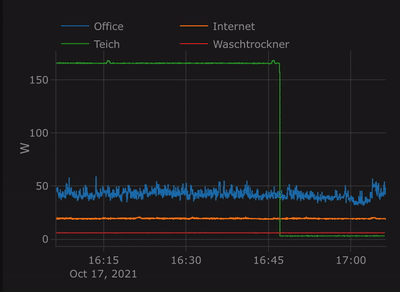
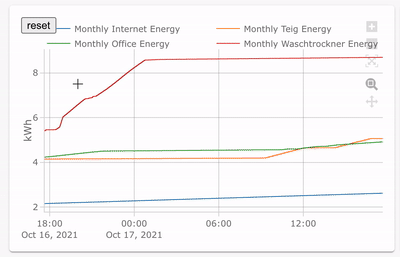

# Plotly Graph Card



<br clear="left"/>


<br clear="left"/>


<br clear="left"/>

## [Post in HomeAssistant community forum](https://community.home-assistant.io/t/plotly-interactive-graph-card/347746)

You may find some extra info there in this link

## More yaml examples

Find more advanced examples in [Show & Tell](https://github.com/dbuezas/lovelace-plotly-graph-card/discussions/categories/show-and-tell)

## Installation via [HACS](https://hacs.xyz/)

- Search for `Plotly Graph Card`.

## Card Config

_**New**_ Visual Config editor available for Basic Configs (\*)

```yaml
type: custom:plotly-graph
entities:
  - sensor.monthly_internet_energy
  - sensor.monthly_teig_energy
  - sensor.monthly_office_energy
  - sensor.monthly_waschtrockner_energy
hours_to_show: 24
refresh_interval: 10
```

(\*) I'm reusing the editor of the standard History Card. Cheap, yes, but it works fine. Use yaml for advanced functionality

## Advanced

### Filling, line width, color


```yaml
type: custom:plotly-graph
entities:
  - entity: sensor.office_plug_wattage
  # see examples: https://plotly.com/javascript/line-and-scatter/
  # see full API: https://plotly.com/javascript/reference/scatter/#scatter
  - entity: sensor.freezer_plug_power
    fill: tozeroy
    line:
      color: red
      dash: dot
      width: 1

layout:
  plot_bgcolor: lightgray
  height: 400
config:
  scrollZoom: false

hours_to_show: 1
refresh_interval: 10 # in seconds
```

### Range Selector buttons


```yaml
type: custom:plotly-graph
entities:
  - entity: sensor.temperature
refresh_interval: 10
hours_to_show: 12
layout:
  xaxis:
    rangeselector:
      # see examples: https://plotly.com/javascript/range-slider/
      # see API: https://plotly.com/javascript/reference/layout/xaxis/#layout-xaxis-rangeselector
      "y": 1.2
      buttons:
        - count: 1
          step: minute
        - count: 1
          step: hour
        - count: 12
          step: hour
        - count: 1
          step: day
        - count: 7
          step: day
```

## Features

- Anything you can do with scatter and barcharts in plotly
- Zoom / Pan, etc.
- Data is loaded in the background
- Axes are automatically configured based on the units of each trace
- Configuration compatible with the History Card

For now only the only allowed chart types are:

- Bar charts https://plotly.com/javascript/bar-charts/#basic-bar-chart
- Line and scatter https://plotly.com/javascript/line-and-scatter/

## Entities:

- `entities` translates to the `data` argument in PlotlyJS

  - each `entity` will be translated to a trace inside the data array.
    - `x` (states) and `y` (timestamps of stored states)
    - you can add any attribute that works in a plotly trace
    - see https://plotly.com/javascript/reference/scatter/#scatter-line for more

```yaml
entities:
  - entity: sensor.temperature
  - entity: sensor.humidity
```

## Color schemes

Changes default line colors.
See more here: https://github.com/dbuezas/lovelace-plotly-graph-card/blob/master/src/color-schemes.ts

```yaml
type: custom:plotly-graph
entities:
  - sensor.temperature1
  - sensor.temperature2
color_scheme: dutch_field
# or use numbers instead 0 to 24 available:
# color_scheme: 1
# or pass your color scheme
# color_scheme: ["#1b9e77","#d95f02","#7570b3","#e7298a","#66a61e","#e6ab02","#a6761d","red"]
```

### Attribute values

Plot the attributes of an entity by adding `::atribute_name` to the entity name

```yaml
entities:
  - entity: climate.living::temperature
  - entity: climate.kitchen::temperature
```

## Extra entity attributes:

```yaml
entities:
  - entity: sensor.temperature_in_celsius
    name: living temperature in Farenheit # Overrides the entity name
    lambda: |- # Transforms the data
      (ys) => ys.map(y => (y × 9/5) + 32)
    unit_of_measurement: °F # Overrides the unit
    show_value: # shows the last value with 40% right margin
      right_margin: 40
    texttemplate: >- # custom format for show_value
      <b>%{y}</b>%{customdata.unit_of_measurement}<br>
      %{customdata.name}
    hovertemplate: >- # custom format for tooltip
      <b>%{customdata.name}</b><br><i>%{x}</i><br>
      %{y}%{customdata.unit_of_measurement}
      <extra></extra>
```

### `lambda:` transforms

`lambda` takes a js function (as a string) to pre process the data before plotting it. Here you can do things like normalisation, integration. For example:

#### Normalisation wrt to last

```yaml
type: custom:plotly-graph
entities:
  - entity: sensor.my_sensor
     lambda: |-
        (ys) => ys.map(y => y/ys[ys.length-1])
```

#### Normalisation wrt to first fetched value

```yaml
  - entity: sensor.my_sensor
     lambda: |-
        (ys) => ys.map(y => y/ys[0])
```

note: `ys[0]` represents the first "known" value, which is the value furthest to the past among the downloaded data. This value will change if you scroll, zoom out, change the hours_to_show, or just let time pass.

#### Accumulated value

```yaml
  - entity: sensor.my_sensor
     unit_of_measurement: "total pulses"
     lambda: |-
        (ys) => {
          let accumulator = 0;
          return ys.map(y => accumulator + y)
        }
```

#### Derivative

```yaml
  - entity: sensor.my_sensor
     unit_of_measurement: "pulses / second"
     lambda: |-
        (ys, xs) => {
          let last = {
            x: new Date(),
            y: 0,
          }
          return ys.map((y, index) => {
            const x = xs[index];
            const dateDelta = x - last.x;
            accumulator += (y - last.y) / dateDelta;
            last = { x, y };
            return accumulator;
          })
        }
```

#### Right hand riemann integration

```yaml
  - entity: sensor.my_sensor
     unit_of_measurement: "kWh"
     lambda: |-
        (ys, xs) => {
          let accumulator = 0;
          let last = {
            x: new Date(),
            y: 0,
          }
          return ys.map((y, index) => {
            const x = xs[index]
            const dateDelta = x - last.x;
            accumulator += last.y * dateDelta;
            last = { x, y };
            return accumulator;
          })
        }
```

#### Access all entity attributes inside lambda

```yaml
- entity: climate.wintergarten_floor::valve
  unit_of_measurement: °C
  lambda: |-
    (ys, xs, entity) => 
      entity.map(({attributes}) => 
        return +attributes.temperature - (+attributes.valve / 100) * 2
      )
```

#### Custom x coordinates of traces

```yaml
- entity: climate.wintergarten_floor
  unit_of_measurement: °C
  lambda: |-
    (ys, xs, entity) => ({
      x: xs.map(x => -x),
      y: ys.map(y => y / 2),
    })
```

## Default trace & axis styling

default configurations for all entities and all yaxes (e.g yaxis, yaxis2, yaxis3, etc).

```yaml
entities:
  - sensor.temperature1
  - sensor.temperature2
defaults:
  entity:
    fill: tozeroy
    line:
      width: 2
  yaxes:
    fixedrange: true # disables vertical zoom & scroll
```

## layout:

To define layout aspects, like margins, title, axes names, ...
Anything from https://plotly.com/javascript/reference/layout/.

### disable default layout:

Use this if you want to use plotly default layout instead. Very useful for heavy customization while following pure plotly examples.

```yaml
entities:
  - entity: sensor.temperature_in_celsius
no_default_layout: true
```

### disable Home Assistant themes:

```yaml
entities:
  - entity: sensor.temperature_in_celsius
no_theme: true
```

## config:

To define general configurations like enabling scroll to zoom, disabling the modebar, etc.
Anything from https://plotly.com/javascript/configuration-options/.

## significant_changes_only

When true, will tell HA to only fetch datapoints with a different state as the one before.
More here: https://developers.home-assistant.io/docs/api/rest/ under `/api/history/period/<timestamp>`

Caveats:
1. zana-37 repoorts that `minimal_response: false` needs to be set to get all non-significant datapoints [here](https://github.com/dbuezas/lovelace-plotly-graph-card/issues/34#issuecomment-1085083597).
2. This configuration will be ignored (will be true) while fetching [Attribute Values](#Attribute-Values).

```yaml
significant_changes_only: true # defaults to false
```

## minimal_response

When true, tell HA to only return last_changed and state for states other than the first and last state (much faster).
More here: https://developers.home-assistant.io/docs/api/rest/ under `/api/history/period/<timestamp>`

Caveats:
1. This configuration will be ignored (will be true) while fetching [Attribute Values](#Attribute-Values).

```yaml
minimal_response: false # defaults to true
```

Update data every `refresh_interval` seconds. Use `0` or delete the line to disable updates

## hours_to_show:

How many hours are shown.
Exactly the same as the history card, except decimal values (e.g `0.1`) do actually work

## refresh_interval:

Update data every `refresh_interval` seconds. Use `0` or delete the line to disable updates

# Development

- Clone the repo
- run `npm i`
- run `npm start`
- From a dashboard in edit mode, go to `Manage resources` and add `http://127.0.0.1:8000/plotly-graph-card.js` as url with resource type JavaScript
- ATTENTION: The development card is `type: custom:plotly-graph-dev`
- Either use Safari or Disbale [chrome://flags/#block-insecure-private-network-requests](chrome://flags/#block-insecure-private-network-requests): Chrome doesn't allow public network resources from requesting private-network resources - unless the public-network resource is secure (HTTPS) and the private-network resource provides appropriate (yet-undefined) CORS headers. More [here](https://stackoverflow.com/questions/66534759/chrome-cors-error-on-request-to-localhost-dev-server-from-remote-site)

# Build

`npm run build`

# Release

- `npm version minor`
- git push
- click on releases/new draft from tag in github

Automated release pending.
