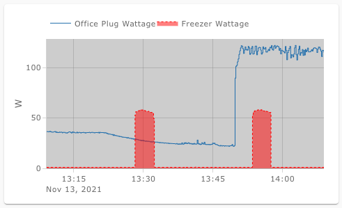
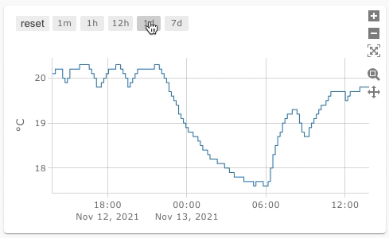
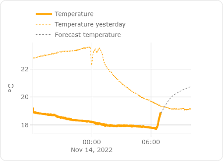
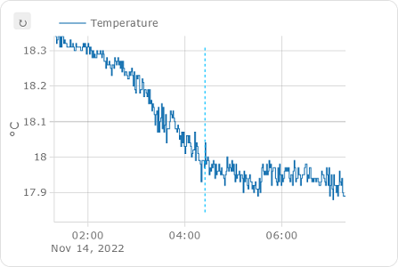

[](https://www.buymeacoffee.com/dbuezas)
[](https://github.com/hacs/integration)

# Plotly Graph Card


<br clear="both"/>
<br clear="both"/>


<br clear="both"/>
<br clear="both"/>


<br clear="both"/>

## [Post in HomeAssistant community forum](https://community.home-assistant.io/t/plotly-interactive-graph-card/347746)

You may find some extra info there in this link

## [Index of examples with images](./discussion-index.md)

You can browse this list and find yamls by looking at images

Created with this [quick and dirty script](./discussion-index.mjs)

## More yaml examples

Find more advanced examples in [Show & Tell](https://github.com/dbuezas/lovelace-plotly-graph-card/discussions/categories/show-and-tell)

## Yaml syntax validatoin

Web app to assist you with syntax validation and autocomplete: [Plotly graph card yaml editor](https://dbuezas.github.io/lovelace-plotly-graph-card/)


## Installation

### Via Home Assistant Community Store (Recommended)

[](https://my.home-assistant.io/redirect/hacs_repository/?owner=dbuezas&repository=lovelace-plotly-graph-card&category=Dashboard)

1. Install [HACS](https://hacs.xyz/docs/configuration/basic)
2. Search & Install `Plotly Graph Card`.

### Manually

1. Go to [Releases](https://github.com/dbuezas/lovelace-plotly-graph-card/releases)
2. Download **all** `.js` files of the release into `<config>/www/plotly-graph-card/`. The card loads the other files only when a chart needs them. From a terminal on Home Assistant:
   ```sh
   mkdir -p /config/www/plotly-graph-card && cd /config/www/plotly-graph-card
   curl -s https://api.github.com/repos/dbuezas/lovelace-plotly-graph-card/releases/latest | grep -o '"browser_download_url": *"[^"]*"' | cut -d'"' -f4 | xargs -n1 curl -sLO
   ```
3. Add a resource to your dashboard configuration. There are two ways:
   1. **Using UI**: `Settings` → `Dashboards` → `More Options icon` → `Resources` → `Add Resource` → Set Url as `/local/plotly-graph-card/plotly-graph-card.js` → Set Resource type as `JavaScript Module`.
      _Note: If you do not see the Resources menu, you will need to enable Advanced Mode in your User Profile_
   2. **Using YAML**: Add following code to lovelace section.
      ```resources:
        - url: /local/plotly-graph-card/plotly-graph-card.js
          type: module
      ```

## Card Config

Visual Config editor available for Basic Configs (\*)

```yaml
type: custom:plotly-graph
entities:
  - sensor.monthly_internet_energy
  - sensor.monthly_teig_energy
  - sensor.monthly_office_energy
  - sensor.monthly_waschtrockner_energy
hours_to_show: 24
refresh_interval: 10
```

(\*) I'm reusing the editor of the standard History Card. Cheap, yes, but it works fine. Use yaml for advanced functionality

The visual editor's `min_y_axis` and `max_y_axis` settings control the main
Y-axis range. Either bound can be omitted to keep that side automatic.
Bounds are entered in data units, including on logarithmic axes. Non-finite
bounds and non-positive logarithmic bounds are ignored. If the minimum exceeds
the maximum, both editor bounds are ignored. If a single bound would reverse the
automatically calculated range, that bound is ignored as well.

`logarithmic_scale: true` selects a logarithmic main Y-axis.
When false or omitted, Plotly chooses the axis type automatically unless
explicitly configured.
`fit_y_data: true` expands the automatic range to include both the data and the
editor bounds, rather than using the bounds as fixed limits.
Explicit Plotly axis types, ranges, autorange settings and `autorangeoptions`
(including those in an inline template) take precedence over the corresponding
editor settings.
`autorange_after_scroll: true` recalculates the main Y-axis after every render,
overriding fixed editor bounds. Bounds included by `fit_y_data` remain included.

## Advanced

### Filling, line width, color



```yaml
type: custom:plotly-graph
entities:
  - entity: sensor.office_plug_wattage
  # see examples: https://plotly.com/javascript/line-and-scatter/
  # see full API: https://plotly.com/javascript/reference/scatter/#scatter
  - entity: sensor.freezer_plug_power
    fill: tozeroy
    line:
      color: red
      dash: dot
      width: 1

layout:
  plot_bgcolor: lightgray
  height: 400
config:
  scrollZoom: false

hours_to_show: 1h
refresh_interval: 10 # in seconds
```

### Range Selector buttons



```yaml
type: custom:plotly-graph
entities:
  - entity: sensor.temperature
refresh_interval: 10
hours_to_show: 12h
layout:
  xaxis:
    rangeselector:
      # see examples: https://plotly.com/javascript/range-slider/
      # see API: https://plotly.com/javascript/reference/layout/xaxis/#layout-xaxis-rangeselector
      "y": 1.2
      buttons:
        - count: 1
          step: minute
        - count: 1
          step: hour
        - count: 12
          step: hour
        - count: 1
          step: day
        - count: 7
          step: day
```

See also: [autorange_after_scroll](#autorange_after_scroll)

See also: [Custom buttons](https://github.com/dbuezas/lovelace-plotly-graph-card/discussions/231#discussioncomment-4869001)


## Features

- Anything you can do with in plotlyjs except maps
- Zoom / Pan, etc.
- Data is loaded on demand
- Axes are automatically configured based on the units of each trace
- Basic configuration compatible with the History Card

Get ideas from all charts in here https://plotly.com/javascript/

## Entities:

- `entities` translates to the `data` argument in PlotlyJS

  - each `entity` will be translated to a trace inside the data array.
    - `x` (states) and `y` (timestamps of stored states)
    - you can add any attribute that works in a plotly trace
    - see https://plotly.com/javascript/reference/scatter/#scatter-line for more

```yaml
type: custom:plotly-graph
entities:
  - entity: sensor.temperature
  - entity: sensor.humidity
```

Alternatively:

```yaml
type: custom:plotly-graph
entities:
  - sensor.temperature
  - sensor.humidity
```

## Trace names

A trace is named after its entity. The name comes from Home Assistant's own
naming, so it matches what the built-in cards show and follows a renamed device
or area.

Set `name` to override it:

```yaml
type: custom:plotly-graph
entities:
  - entity: sensor.living_room_thermostat_temperature
    name: Inside
```

On Home Assistant 2026.4 and later, `name` can also be a list of parts, so you
can pick which context to show. In a legend with several traces, dropping the
device name is often what makes the labels readable:

```yaml
type: custom:plotly-graph
entities:
  - entity: sensor.living_room_thermostat_temperature
    name:
      - type: area
      - type: entity
```

Each part is one of `entity`, `device`, `area`, `floor`, or `text` with a
literal value (`{type: text, text: "Inside"}`). Parts that resolve to nothing
are dropped. Earlier Home Assistant versions cannot resolve a list and fall back
to the entity's friendly name, so a plain string keeps working everywhere.

Filters that rename their trace still win: `trendline` labels its trace `Trend`,
and any `fn` filter returning a new `meta.friendly_name` behaves the same way.
`$ex meta.friendly_name` also keeps returning the entity's `friendly_name`
attribute, unchanged.

## Color schemes

Changes default line and bar colors. Explicit `line.color` and `marker.color`
settings take precedence. Bar fills use `marker.color`.
Explicit Plotly `layout.colorway` or template palettes are also preserved.
See more here: https://github.com/dbuezas/lovelace-plotly-graph-card/blob/master/src/parse-config/parse-color-scheme.ts

```yaml
type: custom:plotly-graph
entities:
  - sensor.temperature1
  - sensor.temperature2
color_scheme: dutch_field
# or use numbers instead 0 to 24 available:
# color_scheme: 1
# or pass your color scheme
# color_scheme: ["#1b9e77","#d95f02","#7570b3","#e7298a","#66a61e","#e6ab02","#a6761d","red"]
```

### Attribute values

Plot the attributes of an entity

```yaml
type: custom:plotly-graph
entities:
  - entity: climate.living
    attribute: temperature
  - entity: climate.kitchen
    attribute: temperature
```

### Statistics support

Fetch and plot long-term statistics of an entity

#### for entities with state_class=measurement (normal sensors, like temperature)

```yaml
type: custom:plotly-graph
entities:
  - entity: sensor.temperature
    statistic: max # `min`, `mean` of `max`
    period: 5minute # `5minute`, `hour`, `day`, `week`, `month`, `auto` # `auto` varies the period depending on the zoom level
```

#### Mean line with a min/max band

Use three traces to show the mean inside the range of recorded measurements.
The sensor must have `min`, `max` and `mean` statistics, for example a temperature
measurement sensor. Replace `sensor.temperature` in all three entries below.

```yaml
type: custom:plotly-graph
hours_to_show: 7d
refresh_interval: 300
defaults:
  entity:
    period: hour
    type: scatter
    mode: lines
    legendgroup: temperature
    line:
      shape: linear
      color: rgb(52,152,219)
layout:
  legend:
    groupclick: togglegroup
entities:
  - entity: sensor.temperature
    statistic: min
    name: Minimum
    showlegend: false
    hoverinfo: skip
    hovertemplate: null
    line:
      width: 0.5
  - entity: sensor.temperature
    statistic: max
    name: Maximum
    showlegend: false
    hoverinfo: skip
    hovertemplate: null
    line:
      width: 0.5
    fill: tonexty
    fillcolor: rgba(52,152,219,0.2)
  - entity: sensor.temperature
    statistic: mean
    name: Temperature
    show_value: true
    line:
      width: 2
```

Keep the minimum and maximum adjacent: `fill: tonexty` fills the area between
the maximum and the preceding minimum trace. The mean is drawn last, above the
band. Their shared `legendgroup` lets the single legend entry toggle all three
traces and the mean's value label together. Hover labels are shown only for the
mean.

All three traces reuse the same statistics response when their sensor, period
and time range match. Common line settings belong in `defaults.entity.line`;
change the line color and `fillcolor` together to recolor the band.

#### for entities with state_class=total (such as utility meters)

```yaml
type: custom:plotly-graph
entities:
  - entity: sensor.temperature
    statistic: state # `state` or `sum`
    period: 5minute # `5minute`, `hour`, `day`, `week`, `month`, `auto` # `auto` varies the period depending on the zoom level
```

#### automatic period

The option `auto` makes the period relative to the currently visible time range. It picks the longest period, such that there are at least 100 datapoints in screen.

```yaml
type: custom:plotly-graph
entities:
  - entity: sensor.temperature
    statistic: mean
    period: auto
```

It is equivalent to writing:

```yaml
type: custom:plotly-graph
entities:
  - entity: sensor.temperature
    statistic: mean
    period:
      0m: 5minute
      100h: hour
      100d: day
      100w: week
      100M: month # note uppercase M for month. Lowercase are minutes
```

#### step function for auto period

```yaml
type: custom:plotly-graph
entities:
  - entity: sensor.temperature
    statistic: mean
    period:
      0s: 5minute
      24h: hour # when the visible range is ≥ 1 day, use the `hour` period
      7d: day # from 7 days on, use `day`
      6M: week # from 6 months on, use weeks. Note Uppercase M! (lower case m means minutes)
      1y: month # from 1 year on, use `month
```

Note that `5minute` period statistics are limited in time as normal recorder history is, contrary to other periods which keep data for years.

## show_value:

Shows the value of the last datapoint as text in a scatter plot.

> Warning: don't use it with bar charts, it will only add an extra bar and no text

Examples:

```yaml
type: custom:plotly-graph
entities:
  - entity: sensor.temperature
    show_value: true
```

Often one wants this to be the case for all entities

```yaml
defaults:
  entity:
    show_value: true
```

If you want to make extra room for the value, you can either increase the right margin of the whole plot like this:

```yaml
layout:
  margin:
    r: 100
```

Or make space inside the the plot like this:

```yaml
time_offset: 3h
```

## Offsets

Offsets are useful to shift data in the temporal axis. For example, if you have a sensor that reports the forecasted temperature 3 hours from now, it means that the current value should be plotted in the future. With the `time_offset` attribute you can shift the data so it is placed in the correct position.
Another possible use is to compare past data with the current one. For example, you can plot yesterday's temperature and the current one on top of each other.

The `time_offset` flag can be specified in two places.
**1)** When used at the top level of the configuration, it specifies how much "future" the graph shows by default. For example, if `hours_to_show` is 16 and `time_offset` is 3h, the graph shows the past 13 hours (16-3) plus the next 3 hours.
**2)** When used at the trace level, it offsets the trace by the specified amount.

```yaml
type: custom:plotly-graph
hours_to_show: 16
time_offset: 3h
entities:
  - entity: sensor.current_temperature
    line:
      width: 3
      color: orange
  - entity: sensor.current_temperature
    name: Temperature yesterday
    time_offset: 1d
    line:
      width: 1
      dash: dot
      color: orange
  - entity: sensor.temperature_12h_forecast
    time_offset: 12h
    name: Forecast temperature
    line:
      width: 1
      dash: dot
      color: grey
```



### Now line

When using offsets, it is useful to have a line that indicates the current time. This can be done by using a universal function that returns a line with the current time as x value and 0 and 1 as y values. The line is then hidden from the legend.

```yaml
type: custom:plotly-graph
hours_to_show: 6h
time_offset: 3h
entities:
  - entity: sensor.forecast_temperature
    yaxis: y1
    time_offset: 3h
  - entity: ""
    name: Now
    yaxis: y9
    showlegend: false
    line:
      width: 1
      dash: dot
      color: deepskyblue
    x: $ex [new Date(), new Date()]
    y: [0, 1]
layout:
  yaxis9:
    visible: false
    fixedrange: true
```



## Duration

Whenever a time duration can be specified, this is the notation to use:

| Unit         | Suffix | Notes    |
| ------------ | ------ | -------- |
| Milliseconds | `ms`   |          |
| Seconds      | `s`    |          |
| Minutes      | `m`    |          |
| Hours        | `h`    |          |
| Days         | `d`    |          |
| Weeks        | `w`    |          |
| Months       | `M`    | 30 days  |
| Years        | `y`    | 365 days |

Example:

```yaml
time_offset: 3h
```

## Extra entity attributes:

```yaml
type: custom:plotly-graph
entities:
  - entity: sensor.temperature_in_celsius
    name: living temperature in Farenheit # Overrides the entity name
    unit_of_measurement: °F # Overrides the unit
    show_value: true # shows the last value as text
    customdata: |
      $fn ({states}) => 
        states.map( () => ({ extra_attr: "hello" }) )
      # customdata is array with the same number of values as x axis (states)
      # use statistics instead of states if entity is based on statistic   
    texttemplate: >- # custom format for show_value
      <b>%{y}</b>%{customdata.extra_attr}<br>
      # to show only 2 decimals: "%{y:.2f}"
      # see more here: https://plotly.com/javascript/hover-text-and-formatting/
      # only x, y, customdata are available as %{} template

    hovertemplate: | # custom format for hover text using entity properites name and unit_of_measurement
      $fn ({ getFromConfig }) =>
      ` <b>${getFromConfig(".name")}</b><br>
      <i>%{x}</i><br>
      %{y}${getFromConfig(".unit_of_measurement")}
      <extra></extra>` # <extra></extra> removes text on the side of the tooltip (it otherwise defaults to the entity name)
```

### Extend_to_present

The boolean `extend_to_present` will take the last known datapoint and "expand" it to the present by creating a duplicate and setting its date to `now`.
This is useful to make the plot look fuller.
It's recommended to turn it off when using `offset`s, or when setting the mode of the trace to `markers`.
Defaults to `true` for state history, and `false` for statistics.

```yaml
type: custom:plotly-graph
entities:
  - entity: sensor.weather_24h_forecast
    mode: "markers"
    extend_to_present: false # true by default for state history
  - entity: sensor.actual_temperature
    statistics: mean
    extend_to_present: true # false by default for statistics
```

### `filters:`

Filters are used to process the data before plotting it. Inspired by [ESPHome's sensor filters](https://esphome.io/components/sensor/index.html#sensor-filters).
Filters are applied in order.

```yaml
type: custom:plotly-graph
entities:
  - entity: sensor.temperature_in_celsius
    filters:
      - store_var: myVar # stores the datapoints inside `vars.myVar`
      - load_var: myVar # loads the datapoints from `vars.myVar`
      - align_timestamps: myVar # matches its timestamps to the current trace, available as `vars.aligned.myVar`

      # The filters below will only be applied to numeric values. Missing (unavailable) and non-numerics will be left untouched
      - add: 5 # adds 5 to each datapoint
      - multiply: 2 # multiplies each datapoint by 2
      - calibrate_linear:
        # Left of the arrow are the measurements, right are the expected values.
        # The mapping is then approximated through linear regression, and that correction is applied to the data.
        - 0.0 -> 0.0
        - 40.0 -> 45.0
        - 100.0 -> 102.5
      - deduplicate_adjacent # removes all adjacent duplicate values. Useful for type: marker+text
      - delta # computes the delta between each two consecutive numeric y values.
      - derivate: h # computes rate of change per unit of time: h # ms (milisecond), s (second), m (minute), h (hour), d (day), w (week), M (month), y (year)
      - integrate: h # computes area under the curve in a specific unit of time using Right hand riemann integration. Same units as the derivative
      - integrate:
          unit: h # defaults to h
          reset_every: 1h # Defaults to 0 (never reset). Any duration unit (ms, s, m, h, d, w, M, y).
          offset: 30m # defaults to 0. Resets happen 30m later

      - map_y_numbers: Math.sqrt(y + 10*100) # map the y coordinate of each datapoint. Same available variables as for `map_y`
      # In the filters below, missing and non numeric datapoints will be discarded
      - sliding_window_moving_average: # best for smoothing
          # default parameters:
          window_size: 10
          extended: false # when true, smaller window sizes are used on the extremes.
          centered: true # compensate for averaging lag by offsetting the x axis by half a window_size
      - exponential_moving_average: # good for smoothing
          # default parameters:
          alpha: 0.1 # between 0 an 1. The lower the alpha, the smoother the trace.
      - median: # got to remove outliers
          # default parameters:
          window_size: 10
          extended: false
          centered: true
      - trendline # converts the data to a linear trendline // TODO: force line.shape = linear
      - trendline: linear # defaults to no forecast, no formula, no error squared
      - trendline:
          type: polynomial # linear, polynomial, power, exponential, theil_sen, robust_polynomial, fft
          forecast: 1d # continue trendline after present. Use global time_offset to show beyond present.
          degree: 3 # only appliable to polynomial regression and fft.
          show_formula: true
          show_r2: true
      # The filters below receive all datapoints as they come from home assistant. Y values are strings or null (unless previously mapped to numbers or any other type)
      - map_y: 'y === "heat" ? 1 : 0' # map the y values of each datapoint. Variables `i` (index), `x`, `y`, `state`, `statistic`, `xs`, `ys`, `states`, `statistics`, `meta`, `vars` and `hass` are in scope. The outer quoutes are there because yaml doesn't like colons in strings without quoutes.
      - map_x: new Date(+x + 1000) # map the x coordinate (javascript date object) of each datapoint. Same variables as map_y are in scope
      - fn: |- # arbitrary function. Only the keys that are returned are replaced. Returning null or undefined, leaves the data unchanged (useful )
          ({xs, ys, vars, meta, states, statistics, hass}) => {
            # either statistics or states will be available, depending on if "statistics" are fetched or not
            # attributes will be available inside states only if an attribute is picked in the trace
            return {
              ys: states.map(state => +state?.attributes?.current_temperature - state?.attributes?.target_temperature + hass.states["sensor.temperature"].state,
              meta: { unit_of_measurement: "delta" }
            };
          },
      - resample: 5m # Rebuilds data so that the timestamps in xs are exact multiples of the specified interval, and without gaps. The parameter is the length of the interval and defaults to 5 minutes (see #duration for the format). This is useful when combining data from multiple entities, as the index of each datapoint will correspond to the same instant of time across them.
      - resample:
          interval: 5m # defaults to 5m
          interpolate: true # defaults to false (each new point holds the last known value). When true, values are linearly interpolated between the surrounding datapoints. Only numbers are interpolated, so use it after force_numeric (or map_y_numbers)
      - filter: y !== null && +y > 0 && x > new Date(Date.now()-1000*60*60) # filter out datapoints for which this returns false. Also filters from xs, states and statistics. Same variables as map_y are in scope
      - force_numeric # converts number-lookinig-strings to actual js numbers and removes the rest. Any filters used after this one will receive numbers, not strings or nulls. Also removes respective elements from xs, states and statistics parameters
```

#### Examples

##### Celcious to farenheit

```yaml
- entity: sensor.wintergarten_clima_temperature
  unit_of_measurement: °F
  filters: # °F = °C×(9/5)+32
    - multiply: 1.8
    - add: 32
```

alternatively,

```yaml
- entity: sensor.wintergarten_clima_temperature
  unit_of_measurement: °F
  filters: # °F = °C×(9/5)+32
    - map_y_numbers: y * 9/5 + 32
```

##### Energy from power

```yaml
- entity: sensor.fridge_power
  filters:
    - integrate: h # resulting unit_of_measurement will be Wh (watts hour)
```

##### Using state attributes

```yaml
- entity: climate.loungetrv_climate
  attribute: current_temperature # an attribute must be set to ensure attributes are fetched.
  filters:
    - map_y_numbers: |
        state.state === "heat" ? state.attributes.current_temperature : 0
```

or alternatively,

```yaml
- map_y_numbers: 'state.state === "heat" ? y : 0'
```

or alternatively,

```yaml
- map_y_numbers: |
    {
      const isHeat = state.state === "heat";
      return isHeat ? y : 0;
    }
```

or alternatively,

```yaml
- map_y: |
    state?.state === "heat" ? state.attributes?.current_temperature : 0
```

or alternatively,

```yaml
- fn: |-
    ({ys, states}) => ({
      ys: states.map((state, i) =>
        state?.state === "heat" ? state.attributes?.current_temperature : 0
      ),
    }),
```

or alternatively,

```yaml
- fn: |-
    ({ys, states}) => {
      return {
        ys: states.map((state, i) =>
          state?.state === "heat" ? state.attributes?.current_temperature : 0
        ),
      }
    },
```

#### Advanced

##### Debugging

1. Open [your browser's devtools console](https://balsamiq.com/support/faqs/browserconsole/)
2. Use `console.log` or the `debugger` statement to execute your map filter step by step
   ```yaml
   type: custom:plotly-graph
   entities:
     - entity: sensor.temperature_in_celsius
       statistics: mean
       filters:
         - fn: console.log # open the devtools console to see the data
         - fn: |-
             (params) => {
               const ys = [];
               debugger;
               for (let i = 0; i < params.statistics.length; i++){
                 ys.pushh(params.statistics.max); // <--- here's the bug
               }
               return { ys };
             }
   ```

##### Using the hass object

Funcitonal filters receive `hass` (Home Assistant) as parameter, which gives you access to the current states of all entities.

```yaml
type: custom:plotly-graph
entities:
  - entity: sensor.power_consumption
    filters:
      - map_y: parseFloat(y) * parseFloat(hass.states['sensor.cost'].state)
```

This can also be used to fetch data by calling a HA service. As this is a call that requires a network connection, the function needs to be defined `async`:
```yaml
    filters:
      - fn: |-
          async ({xs, ys, meta, hass}) => {
            const weather = await hass.callService("weather", "get_forecasts", {type: "hourly"}, {entity_id:"weather.home"}, true, true)
            const home = weather.response["weather.home"].forecast
            return {
              xs: home.map(h => new Date(h.datetime)),
              ys: home.map(h => h.temperature)
            }
          }
```

##### Using vars

Use `align_timestamps: name` (or `align_timestamps: [name1, name2]`) to match a
previously stored series to the current trace's exact timestamps under
`vars.aligned`, without changing either original series; missing matches become
`null`. Each call replaces `vars.aligned` with the requested series.
Place it directly before the `map_y` that uses it: intervening filters that drop
or move points, such as `filter` or `resample`, break alignment with `i` again.

```yaml
type: custom:plotly-graph
entities:
  - entity: sensor.outdoor_temperature
    statistic: mean
    period: 5minute
    internal: true
    filters:
      - store_var: outdoor
  - entity: sensor.indoor_temperature
    statistic: mean
    period: 5minute
    name: Temperature difference
    filters:
      - align_timestamps: outdoor
      - map_y: >-
          y == null || vars.aligned.outdoor.ys[i] == null
            ? null : y - vars.aligned.outdoor.ys[i]
```

Compute absolute humidity

```yaml
type: custom:plotly-graph
entities:
  - entity: sensor.wintergarten_clima_humidity
    internal: true
    filters:
      - resample: 5m # put irregular history on a regular grid
      - map_y: parseFloat(y)
      - store_var: relative_humidity
  - entity: sensor.wintergarten_clima_temperature
    period: 5minute
    name: Absolute Hty
    unit_of_measurement: g/m³
    filters:
      - resample: 5m
      - map_y: parseFloat(y)
      - align_timestamps: relative_humidity
      - map_y: >-
          vars.aligned.relative_humidity.ys[i] == null ? null :
          (6.112 * Math.exp((17.67 * y)/(y+243.5)) * +vars.aligned.relative_humidity.ys[i] * 2.1674)/(273.15+y);
```

Compute dew point

```yaml
type: custom:plotly-graph
entities:
  - entity: sensor.openweathermap_humidity
    internal: true
    period: 5minute
    filters:
      - map_y: parseFloat(y)
      - store_var: relative_humidity
  - entity: sensor.openweathermap_temperature
    period: 5minute
    name: Dew point
    filters:
      - map_y: parseFloat(y)
      - align_timestamps: relative_humidity
      - map_y: >-
          {
            // https://www.omnicalculator.com/physics/dew-point
            const a = 17.625;
            const b = 243.04;
            const T = y;
            const RH = vars.aligned.relative_humidity.ys[i];
            if (RH == null) return null;
            const α = Math.log(RH/100) + a*T/(b+T);
            const Ts = (b * α) / (a - α);
            return Ts; 
          }
hours_to_show: 24
```

### `internal:`

setting it to `true` will remove it from the plot, but the data will still be fetch. Useful when the data is only used by a filter in a different trace. Similar to plotly's `visibility: false`, except it internal traces won't use up new yaxes.

```yaml
type: custom:plotly-graph
entities:
  - entity: sensor.temperature1
    internal: true
    period: 5minute
    filters:
      - map_y: parseFloat(y)
      - store_var: temp1
  - entity: sensor.temperature2
    period: 5minute
    name: sum of temperatures
    filters:
      - map_y: parseFloat(y)
      - align_timestamps: temp1
      - map_y: vars.aligned.temp1.ys[i] == null ? null : y + vars.aligned.temp1.ys[i]
```

### Entity click handlers

When the legend is clicked (or doubleclicked), the trace will be hidden (or showed alone) by default. This behaviour is controlled by [layout-legend-itemclick](https://plotly.com/javascript/reference/layout/#layout-legend-itemclick).
On top of that, a `$fn` function can be used to add custom behaviour.
If a handler returns false, the default behaviour trace toggle behaviour will be disabled, but this will also inhibit the `on_legend_dblclick ` handler. Disable the default behaviour via layout-legend-itemclick instead if you want to use both click and dblclick handlers.

```yaml
type: custom:plotly-graph
entities:
  - entity: sensor.temperature1
    on_legend_click: |-
      $fn () => (event_data) => {
        event = new Event( "hass-more-info")
        event.detail =  { entityId: 'sensor.temperature1' };
        document.querySelector('home-assistant').dispatchEvent(event);
        return false; // disable trace toggling
      }
```

Alternatively, clicking on points of the trace itself.

```yaml
type: custom:plotly-graph
entities:
  - entity: sensor.temperature1
    on_click: |-
      $fn () => ({ points }) => {
        const point = points[0];
        console.log(point.x, point.y, point.customdata);
      }
```

`on_click` receives Plotly's event data. Use the point's `x`, `y` or
`customdata` to read the clicked value. `pointIndex` and `pointNumber` refer
to the rendered trace, not necessarily the original arrays used by filters
or `$fn` functions. Default history step lines can contain drawing-only
endpoints before unavailable states. These repeat the last known value and
its per-point `customdata`; the parsed history remains unchanged.

There is also a double click plot handler, it works on the whole plotting area (not points of an entity). Beware that double click also autoscales the plot.

```yaml
type: custom:plotly-graph
entities:
  - entity: sensor.temperature1
on_dblclick: |-
  $fn ({ hass }) => () => {
    hass.callService('light', 'turn_on', {
      entity_id: 'light.portique_lumiere'
    })
  }
```

## Annotation and button click handlers

In a similar way, you can respond to clicks on annotations (requiring `captureevents: true`).

```yaml
type: custom:plotly-graph
entities:
  - entity: sensor.temperature1
layout:
  annotations:
    - x: 1
      xref: paper
      "y": 1
      yref: paper
      showarrow: false
      text: "📊"
      captureevents: true
      on_click: $ex () => { window.location="/history?entity_id=sensor.temperature1"; }
```

Or to clicks on custom update menu buttons.

```yaml
type: custom:plotly-graph
entities:
  - entity: sensor.temperature1
layout:
  updatemenus:
    - buttons:
        - label: History
          method: skip
          on_click: $ex () => { window.location="/history?entity_id=sensor.temperature1"; }
      showactive: false
      type: buttons
      x: 1
      "y": 1
```

See more in plotly's [official docs](https://plotly.com/javascript/plotlyjs-events)

## Universal functions

Javascript functions allowed everywhere in the yaml. Evaluation is top to bottom and shallow to deep (depth first traversal).

The returned value will be used as value for the property where it is found. E.g:

```js
name: $fn ({ hass }) => hass.states["sensor.garden_temperature"].state
```

or a universal expression `$ex` (the parameters and arrow are added automatically):

```js
name: $ex hass.states["sensor.garden_temperature"].state
```

which can also take a block:

```js
name: |
  $ex {
    return hass.states["sensor.garden_temperature"].state
  }
```

### Available parameters:

Remember you can add a `console.log(the_object_you_want_to_inspect)` and see its content in the devTools console.

#### Everywhere:

- `getFromConfig: (path) => value;` Pass a path (e.g `entities.0.name`) and get back its value
- `get: (path) => value;` same as `getFromConfig`
- `hass: HomeAssistant object;` For example: `hass.states["sensor.garden_temperature"].state` to get its current state
- `vars: Record<string, any>;` You can communicate between functions with this. E.g `vars.temperatures = ys`
- `path: string;` The path of the current function
- `css_vars: HATheme;` The colors and fonts set by the active Home Assistant theme (see #ha_theme)

#### Only inside entities

- `xs: Date[];` Array of timestamps
- `ys: YValue[];` Array of values of the sensor/attribute/statistic
- `statistics: StatisticValue[];` Array of statistics objects
- `states: HassEntity[];` Array of state objects
- `meta: HassEntity["attributes"];` The current attributes of the sensor

#### Gotchas

- The following entity attributes are required for fetching, so if another function needs the entity data it needs to be declared below them. `entity`,`attribute`,`offset`,`statistic`,`period`
- Functions are allowed for those properties (`entity`, `attribute`, ...) but they do not receive entity data as parameters. You can still use the `hass` parameter to get the last state of an entity if you need to.
- Functions cannot return functions for performance reasons. (feature request if you need this)
- Defaults are not applied to the subelements returned by a function. (feature request if you need this)
- You can get other values from the yaml with the `getFromConfig` parameter, but if they are functions they need to be defined before.
- Any function which uses the result of a filter, needs to be placed in the YAML below the filter. For instance, `name: $ex ys.at(-1)` where the filter is modifying `ys`.
- The same is true of consecutive filters - order matters. This is due to the fact that filters are translated internally to function calls, executed in the order they are parsed.

#### Adding the last value to the entitiy's name

```yaml
type: custom:plotly-graph
entities:
  - entity: sensor.garden_temperature
    name: |
      $ex meta.friendly_name + " " + ys[ys.length - 1]
```

#### Sharing data across functions

```yaml
type: custom:plotly-graph
entities:
  - entity: sensor.garden_temperature

    # the fn attribute has no meaning, it is just a placeholder to put a function there. It can be any name not used by plotly
    fn: $ex vars.title = ys[ys.length - 1];
title: $ex vars.title
```

#### Histograms

```yaml
type: custom:plotly-graph
entities:
  - entity: sensor.openweathermap_temperature
    x: $ex ys
    type: histogram
title: Temperature Histogram last 10 days
hours_to_show: 10d
raw_plotly_config: true
layout:
  margin:
    t: 0
    l: 50
    b: 40
  height: 285
  xaxis:
    autorange: true
```

#### custom hover text

```yaml
type: custom:plotly-graph
title: hovertemplate
entities:
  - entity: climate.living
    attribute: current_temperature
    customdata: |
      $fn ({states}) =>
        states.map( ({state, attributes}) =>({
          ...attributes,
          state
        })
      )
    hovertemplate: |-
      <br> <b>Mode:</b> %{customdata.state}<br>
      <b>Target:</b>%{y}</br>
      <b>Current:</b>%{customdata.current_temperature}
      <extra></extra>
hours_to_show: current_day
```

#### disabling hover text

can be achieved by setting inside entities:
```yaml
hovertemplate: null
hoverinfo: 'skip'
```

## Default trace & axis styling

default configurations for all entities and all xaxes (e.g xaxis, xaxis2, xaxis3, etc) and yaxes (e.g yaxis, yaxis2, yaxis3, etc).

```yaml
type: custom:plotly-graph
entities:
  - sensor.temperature1
  - sensor.temperature2
defaults:
  entity:
    fill: tozeroy
    line:
      width: 2
  xaxes:
    showgrid: false # Disables vertical gridlines
  yaxes:
    fixedrange: true # disables vertical zoom & scroll
```

`filters` defined in an entity replace the ones in `defaults.entity.filters` (they are not merged or appended). Use `filters: []` to disable the default filters for one entity.

```yaml
type: custom:plotly-graph
defaults:
  entity:
    filters:
      - force_numeric
entities:
  - sensor.temperature1 # uses force_numeric
  - entity: sensor.temperature2
    filters: # only these filters are applied, force_numeric is not
      - force_numeric
      - multiply: 2
  - entity: sensor.temperature3
    filters: [] # no filters at all
```

Filter lists can also be generated with `$ex` or `$fn`. To reuse filters and
append entity-specific ones, define the shared list before `entities` and the
extra list before `filters`:

```yaml
type: custom:plotly-graph
reused_filters:
  - force_numeric
  - add: 1
entities:
  - entity: sensor.temperature
    extra_filters:
      - multiply: 2
    filters: $ex [...get('reused_filters'), ...get('.extra_filters')]
```

Generated lists run in order, just like literal lists. This additional parsing
is limited to `entities.*.filters`; other function results are not traversed.

## layout:

To define layout aspects, like margins, title, axes names, ...
Anything from https://plotly.com/javascript/reference/layout/.

### Home Assistant theming:

Toggle Home Assistant theme colors and fonts:

- card-background-color
- primary-background-color
- primary-color
- primary-text-color
- secondary-text-color
- font-family, font-size and font-weight (from Home Assistant's typography variables, e.g. `--ha-font-family-body`, `--ha-font-size-s`, `--ha-font-weight-normal`)

Anything set in `layout.font` still takes precedence.

```yaml
type: custom:plotly-graph
entities:
  - entity: sensor.temperature_in_celsius
ha_theme: false #defaults to true
```

You can also use Home Assistant's named theme colors in `$ex` and `$fn` through
`css_vars`. Values are read from the active CSS theme on each render, without
the leading `--`:

```yaml
entities:
  - entity: sensor.temperature_in_celsius
    line:
      color: $ex css_vars['blue-color']
```

Available colors: `accent-color`, `error-color`, `warning-color`, `success-color`,
`info-color`, `divider-color`, `disabled-color`, `red-color`, `pink-color`, `purple-color`,
`deep-purple-color`, `indigo-color`, `blue-color`, `light-blue-color`, `cyan-color`,
`teal-color`, `green-color`, `light-green-color`, `lime-color`, `yellow-color`,
`amber-color`, `orange-color`, `deep-orange-color`, `brown-color`, `light-grey-color`,
`grey-color`, `dark-grey-color`, `blue-grey-color`, `black-color`, and `white-color`.
The five theme variables listed above remain available too. This does not change
the default trace palette, and `css_vars` is also available with `ha_theme: false`.

### Raw plotly config:

Toggle all in-built defaults for layout and entitites. Useful when using histograms, 3d plots, etc.
When true, the `x` and `y` properties of the traces won't be automatically filled with entity data, you need to use $fn for that.

```yaml
type: custom:plotly-graph
entities:
  - entity: sensor.temperature_in_celsius
    x: $ex xs
    y: $ex ys
raw_plotly_config: true # defaults to false
```

## config:

To define general configurations like enabling scroll to zoom, disabling the modebar, etc.
Anything from https://plotly.com/javascript/configuration-options/.

## extended_touch_support

Touch gestures on the plot area:

- Drag with one finger: pan (Plotly).
- Tap: click (Plotly). Double tap: reset (Plotly).
- `pinch_to_zoom`: pinch with two fingers to zoom at the fingers and pan with them, like a map. Lifting one finger keeps panning with the other.
- `double_tap_drag_to_zoom`: double tap, keep the finger down and drag up or down to zoom, left or right to pan.
- `hold_to_scan`: press and hold for 300 ms, then slide. The tooltip follows the finger through the data and stays after lifting the finger, until the next touch. With `hovermode: closest` (Plotly's default) it follows the x position of the finger, like `hovermode: x`. It is off with `hovermode: false`. While it is on, a tap doesn't show the tooltip.

All are on by default. Turn them all off, so only Plotly's own touch handling is left:

```yaml
extended_touch_support: false
```

Or turn off single ones:

```yaml
extended_touch_support:
  pinch_to_zoom: false
  double_tap_drag_to_zoom: false
  hold_to_scan: false
```

See also: [disable_pinch_to_zoom](#disable_pinch_to_zoom) (deprecated)

## hours_to_show:

How many hours are shown.
Exactly the same as the history card, but more powerful

### Fixed Relative Time

- Decimal values (e.g `hours_to_show: 0.5`)
- Duration strings (e.g `hours_to_show: 2h`, `3d`, `1w`, `1M`). See [Durations](#Duration)

### Dynamic Relative Time

Shows the current day, hour, etc from beginning to end.
The options are: `current_minute`, `current_hour`, `current_day`, `current_week`, `current_month`, `current_quarter`, `current_year`
It can be combined with the global `time_offset`.

## autorange_after_scroll:

Removes all data out of the visible range, and autoscales after each replot.
Particularly useful when combined with [Range Selector Buttons](#Range-Selector-buttons)

Filter output is clipped after the complete filter chain when all X values are
`Date` objects. Other X formats and raw Plotly configurations are left unchanged.
No synthetic edge points are added to generated data.

```yaml
type: custom:plotly-graph
entities:
  - entity: sensor.garden_temperature
autorange_after_scroll: true
```

## refresh_interval:

Update data every `refresh_interval` seconds.

With `auto`, live statistics also refresh when Home Assistant publishes new
5-minute or hourly statistics, even if the entity's state has not changed.
Each event refreshes only its matching resolution: daily, weekly and monthly
aggregates refresh with the hourly statistics, not the 5-minute statistics.
Entity state changes can still update the display without refetching statistics.
Zooming, panning and toggling traces only fetch missing ranges; they do not
invalidate cached statistics. Resetting the view also refreshes recent values.
An explicit refresh interval continues to poll at the configured interval.

Examples:

```yaml
refresh_interval: auto # (default) update automatically when an entity changes its state.
refresh_interval: 0 # never update.
refresh_interval: 5 # update every 5 seconds
```

## localization:

The locale is directly taken from Home Assistant's configuration, but can be overridden like this:

```yaml
config:
  locale: ar
```

** Home Assistant custom Number and Date format will be ignored, only the language determines the locale **

When using `hours_to_show: current_week`, the "First day of the week" configured in Home Assistant is used

## time_zone:

Dates are shown in the "Time zone" chosen in the Home Assistant user profile (your browser's or the server's), but it can be overridden like this:

```yaml
time_zone: server # Home Assistant's timezone
time_zone: local # the browser's timezone
time_zone: Europe/Rome # any IANA timezone
```

This also applies to the boundaries of `hours_to_show: current_day` and friends, and to `integrate`'s `reset_every`.

For `integrate`, `reset_every: 1d` resets at calendar midnight in the selected time zone, including 23- and 25-hour days. `reset_every: 24h` and other intervals remain fixed durations. `offset` shifts the reset by the specified elapsed duration after midnight, not by wall-clock hours.

An invalid `time_zone` is reported as an error and the browser's timezone is used instead.

Give times as `Date` objects (e.g. `new Date()`), not as numbers like `Date.now()`: only Dates are converted to the selected time zone, so a number would be drawn in the browser's time zone.

When a timezone other than the browser's is used, the x values Plotly hands back (e.g. `points[0].x` in `on_click`, and hover values) are date strings in that timezone, like `"2024-03-31 02:30:00.000"`, not `Date` objects. Don't pass them to `new Date(...)`, which would read them in the browser's timezone. The `xs` passed to `$fn` and filters are still real `Date`s.

## Presets

If you find yourself reusing the same card configuration frequently, you can save it as a preset.

### Setup

Presets are loaded from the global `PlotlyGraphCardPresets` JS object (such that they can be shared across different dashboards).
The recommended way to add or modify presets is to set up a `plotly_presets.js` script in the `www` subdirectory of your `config` folder.
```js
window.PlotlyGraphCardPresets = {
  // Add your presets here with the following format (or check the examples below)
  // PresetName: { PresetConfiguration }
};
```
To ensure this file is loaded on every dashboard, add the following lines to your `configuration.yaml`.
```yaml
frontend:
  extra_module_url:
    - /local/plotly_presets.js
```
You might have to clear your browser cache or restart HA for changes to take effect.

### Examples

The preset configuration should be defined as a JS object instead of the YAML format used by the card.
Below is an example YAML configuration that is split into several corresponding presets.

<table>
<tr>
<th>YAML configuration</th>
</tr>
<tr>
<td>

```yaml
hours_to_show: current_day
time_offset: -24h
defaults:
  entity:
    hovertemplate: |
      $fn ({ get }) => (
        `%{y:,.1f} ${get('.unit_of_measurement')}<extra>${get('.name')}</extra>`
      )
  xaxes:
    showspikes: true
    spikemode: across
    spikethickness: -2
```

</td>
</tr>
<tr>
<th>Preset configurations</th>
</tr>
<tr>
<td>

```js
window.PlotlyGraphCardPresets = {
  yesterday: { // Start of preset with name 'yesterday'
    hours_to_show: "current_day",
    time_offset: "-24h",
  },
  simpleHover: { // Start of preset with name 'simpleHover'
    defaults: {
      entity: {
        hovertemplate: ({get}) => (
          `%{y:,.1f} ${get('.unit_of_measurement')}<extra>${get('.name')}</extra>`
        ),
      },
    },
  },
  verticalSpikes: { // Start of preset with name 'verticalSpikes'
    defaults: {
      xaxes: {
        showspikes: true,
        spikemode: "across",
        spikethickness: -2,
      },
    },
  },
};
```

</td>
</tr>
</table>

### Usage

To use your defined templates, simply specify the preset name under the `preset` key.
You can also specify a list of preset names to combine several of them.

E.g. with the above preset definitions, we can show yesterday's temperatures.
```yaml
type: custom:plotly-graph
entities:
  - sensor.temperature1
  - sensor.temperature2
preset: yesterday
```

Or show a simplified hover tooltip together with vertical spikes.
```yaml
type: custom:plotly-graph
entities:
  - sensor.temperature1
  - sensor.temperature2
preset:
  - simpleHover
  - verticalSpikes
```

# deprecations:

### `no_theme`

Renamed to `ha_theme` (inverted logic) in v3.0.0

### `no_default_layout`

Replaced with more general `raw_plotly_config` in v3.0.0.
If you were using it, you most likely can delete it and add this to your yaxes defaults:

```yaml
defaults:
  yaxes:
    side: left
    overlaying: "y"
    visible: true
    showgrid: true
```

### `offset`

Renamed to time_offset in v3.0.0 to avoid conflicts with PlotlyJS bar offset configuration.

### `lambda`

Removed in v3.0.0, use filters instead. There is most likely a filter (or combination) that will give you the same result, but you can also translate an old lambda to a filter like this:

```yaml
lambda: |
  (ys,xs) => {
    ...
    return {x: arr_x, y: arr_y};
  }
# becomes
filters:
  - fn: |
    ({ys,xs}) => {
      ...
      return {xs: arr_x, ys: arr_y};
    }
```

and

```yaml
lambda: |
  (ys) => ys.map(y => y+1...etc...)
# becomes
filters:
  - map_y: y+1...etc...
```

### `entities/show_value/right_margin`

Removed in v3.0.0, use `show_value: true` instead and if necessary, set the global `time_offset` or `layout.margins.r` to make extra space to the right.

### `significant_changes_only`

Removed in v3.0.0, non significant changes are also fetched now. The bandwidth savings weren't worth the issues it created.

### `minimal_response`

Removed in v3.0.0, if you need access to the attributes use the 'attribute' parameter instead. It doesn't matter which attribute you pick, all of them are still accessible inside filters and universal functions

### `disable_pinch_to_zoom`

Replaced with [extended_touch_support](#extended_touch_support) in v4.0.0. `disable_pinch_to_zoom: true` still works and is the same as `extended_touch_support: false`.

## Plotly.js 4 compatibility

This card uses Plotly.js 4.1.2. Review custom Plotly configurations when
upgrading from 2.x or 3.x:

Plotly.js 3 removed the deprecated `pointcloud` and `heatmapgl` trace types,
as well as the `transforms` API. Configurations using these features must be
migrated before upgrading.

- Plotly.js 4 removes Mapbox traces and `layout.mapbox`, MathJax 2 support,
  Chart Studio options and `*src` attributes. Use the MapLibre types
  `scattermap`, `choroplethmap` and `densitymap` instead.
- Colors must use valid CSS syntax. `hsv(...)` is no longer supported, and RGB
  channels between 0 and 1 are no longer interpreted as fractions of 255.
  Standard hex colors and `rgba(52, 152, 219, 0.82)` continue to work.
- Geographic plots now default to fitting their locations. Set
  `layout.geo.fitbounds: false` to keep the previous behavior.
- Overlaid, non-categorical axes now default to synchronized ticks (`sync`)
  when no other tick settings are provided. Other axes default to `auto`.
  Explicit `tickmode`, `tickvals` and `dtick` settings are respected. Set
  `tickmode: auto` on an overlaid axis to keep independent ticks.
- The cloud-upload button remains disabled by default, including in raw mode.
  Enable it explicitly with `config.showSendToCloud: true` only if you want
  to send chart data to Plotly Cloud. The previous 300 ms double-click delay
  is also retained unless configured otherwise.

See the [Plotly.js changelog](https://github.com/plotly/plotly.js/blob/v4.1.2/CHANGELOG.md)
for the complete list of changes, including changes to SPLOM axis matching
and event coordinates.

### Titles must use the object form

Plotly.js 3 and later no longer accept a plain string for `title`. Charts
using the old form silently lose their titles. An old-style axis title can
also hide the automatic unit title generated by the card.

Before (no longer works):

```yaml
layout:
  title: Energy
  yaxis:
    title: kW
    titlefont:
      size: 14
```

After:

```yaml
layout:
  title:
    text: Energy
  yaxis:
    title:
      text: kW
      font:
        size: 14
```

This applies to every axis, including `xaxis` and `yaxis2`. Replace
`titlefont` with `title.font`. The other removed title attributes have
component-specific replacements: `titleside` becomes `title.side` on
colorbars, `titleposition` becomes `title.position` on pie traces, and
`titleoffset` becomes `title.offset` on carpet axes. These positioning
properties are not interchangeable with Cartesian axis titles, which use
`title.standoff` for spacing.

The card's own top-level `title:` option is unchanged.

Every Plotly trace type is supported, including `image`, `quiver` and the
MapLibre maps `scattermap`, `choroplethmap` and `densitymap`. WebGL traces
require browser WebGL support. The card only downloads the code of the trace
types it draws: lines and bars come with Plotly's core, other types are loaded
the first time a card needs them.

# Development

- Install [Bun](https://bun.sh)
- Clone the repo
- run `bun install`
- run `bun run start`
- From a dashboard in edit mode, go to `Manage resources` and add `http://127.0.0.1:8000/plotly-graph-card.js` as url with resource type JavaScript Module
- ATTENTION: The development card is `type: custom:plotly-graph-dev` (mind the extra `-dev`)
- Either use Safari or Enable [chrome://flags/#unsafely-treat-insecure-origin-as-secure](chrome://flags/#unsafely-treat-insecure-origin-as-secure) and add your HA address (e.g http://homeassistant.local:8123): Chrome doesn't allow public network resources from requesting private-network resources - unless the public-network resource is secure (HTTPS) and the private-network resource provides appropriate (yet-undefined) CORS headers. More [here](https://stackoverflow.com/questions/66534759/chrome-cors-error-on-request-to-localhost-dev-server-from-remote-site)

# Build

`bun run build`

## Upgrade checks

Run `bun run tsc` and `bun run test src/parse-config/defaults.test.ts` for
the compatibility checks. For rendering checks, install Chromium with
`bunx playwright install chromium` (or set `CHROME=/path/to/chrome`)
and run `bun run test:browser`.
The browser test covers every registered trace type, tank shapes and labels,
axis defaults, cloud-upload opt-in, and a card with a mock Home Assistant state.
Run `bun run test:loading` to check the initial loading height, delayed data,
rendering failures, recovery and reduced-motion support in Chromium.
`bun run test` includes history batching, compressed WebSocket responses, cache reuse,
attributes, time offsets and request failure recovery.
The five additional trace types are also validated and rendered through the card.
Run `bun run test:card-lifecycle` to check initial rendering, recovery from
render failures, event suppression, listener cleanup on reconnect, and mouse
interactions with data points, legend toggles and the reset button.
Run `bun run test:statistics` for statistics batching, cache reuse, period and
time-offset separation, dynamic settings and fallback after failed requests.
Run `bun run test:resize` for unchanged-size callbacks, hidden cards and normal
width changes. These tests do not run Home Assistant's view components.
Run `bun run test:cache` for rolling-window retention, boundary values,
time offsets, browsing, refetching pruned history and in-flight live updates.

# Release

- Click on releases/new draft from tag in github
- The bundle will be built by the CI action thanks to @zanna-37 in #143
- The version in the artifact will be set from the created tag while building.

# Popularity

## Star History

[](https://star-history.com/#dbuezas/lovelace-plotly-graph-card&Date)
